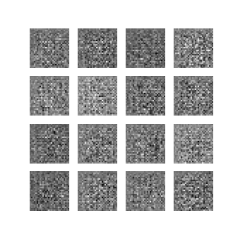

# MNIST DCGAN
This repo implements a dcgan for generating hand-written digits. This work is based on the tensorflow official example available here: https://www.tensorflow.org/tutorials/generative/cyclegan

# Results
The output of the generator can be visualized below, epoch by epoch.  

